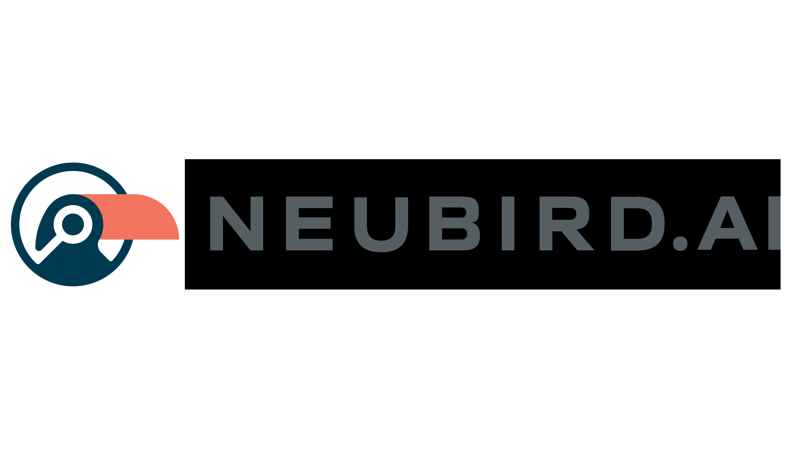

<div align="center">
  
  <h1>NeuBird Desktop</h1>
  <p><strong>The Production Ops Agent in your terminal.</strong></p>
  <p>
    NeuBird connects to your telemetry databases and investigates incidents, health, cost, and performance — using natural language.
  </p>
</div>

---

[](https://asciinema.org/a/eNVVnr9DfzfTHW4r)

## What NeuBird Does

NeuBird is a terminal-native AI agent for site reliability engineering. It connects to your existing telemetry tools — PagerDuty, Datadog, CloudWatch, Grafana, GitHub, Snowflake, and 30+ more — and lets you ask questions in plain English:

- *"What services have the highest error rates right now?"*
- *"Why did latency spike on api-gateway at 2am?"*
- *"How much did cloud costs increase this week and what drove it?"*

NeuBird queries your telemetry, reasons over results across multiple data sources, and delivers a root cause analysis — complete with evidence, sources, and recommended actions.

## Key Features

**Predictive analysis** — Ask what's likely to page you next. NeuBird identifies degradation trends, capacity cliffs, and silent failures before they become incidents.

**Pre-deployment risk assessment** — Evaluate code changes before they reach production. NeuBird cross-references PRs with live telemetry to tell you what could break and why.

**Agentic investigations** — NeuBird doesn't just answer questions. It explores your schema, runs multiple queries, correlates data across sources, and iterates until it finds the answer. You watch the investigation unfold in real time.

**Health sweeps** — Run `/health` for a full infrastructure health check. NeuBird scans incidents, alarms, error logs, and recent deployments, then produces a Good/Bad/Ugly summary with recommended actions.

**Cost analysis** — `/cost` analyzes cloud spending trends and projects 24-hour costs with breakdowns by service, team, and resource type.

**Three agent personas** — Switch between investigation styles to match the situation:

| Persona | Model | Best for |
|---|---|---|
| **Responder** | Claude Haiku | Fast triage, immediate next actions |
| **Analyst** | Claude Sonnet | Root cause analysis, deep investigation |
| **Architect** | Claude Opus | Runbooks, design reviews, systemic fixes |

**Collapsible tool output** — Press `Ctrl+O` to review every tool call and result from an investigation — even while it's still running. Expand individual calls to inspect full data tables, or collapse them to focus on the analysis. Works mid-investigation: pause to browse results, then press `Esc` to resume watching.

**Local CLI integration** — NeuBird automatically detects SRE tools on your machine (kubectl, docker, aws, gcloud, helm, git, terraform, curl, dig, openssl) and makes them available to the AI agent as read-only tools. Ask "how many pods are in the production namespace?" and NeuBird will run `kubectl get pods` directly. All commands are safety-gated — destructive operations (apply, delete, create, scale) are blocked at the code level.

**Web search** — When an investigation needs context beyond your telemetry — CVE details, vendor status pages, documentation, or recent outage reports — NeuBird searches the web for supporting evidence. Web search integrates naturally alongside SQL queries and CLI tools.

**Live investigation dashboard** — While an investigation runs, three progress bars update in real time:

```text
  ██████████████████████████████████░░░░░░ 85% wrapping up · turn 15 · 22 tools • 52.3s
  ████████████████████░░░░░░░░░░░░░░░░░░░░ 50% confidence
  ████████████████████████░░░░░░░░░░░░░░░░ 2.4 MB · 1,247 rows · 8 queries      (Ctrl+C)
```

Progress tracks investigation phase, confidence shows the AI's self-assessed certainty (can go down — that's useful signal), and data read shows cumulative telemetry volume on a logarithmic scale. On completion:

```text
  ──────────────────────────────────────────────────────────────────────────
  ✅ completed in 3m52.1s · 17 turns · 21 tools · 80% confidence · 49.4 KB read
  📊 Data sources: config_aws_prod.aws_elbv2_target_groups, metric_aws_prod.rds_cpu
```

**Tool inventory** — On startup, NeuBird displays every tool available to the agent — grouped by source (built-in, cloud MCP, local CLI). Run `/tools` anytime to see the full inventory with capabilities. Example:

```
🔧 Tool inventory (18 tools)
  📦 Built-in (12)
     ✓ exec_sql                  Execute SQL queries against the database
     ✓ list_schemas              List database schemas
     ...
  ☁️  ACE MCP (4)
     ✓ external_tool             External service queries
     ...
  💻 Local CLI (2)
     ✓ kubectl                   Read-only Kubernetes inspection (pods, logs, events)
     ✓ run_local_command         Execute read-only local CLI commands
  🔍 Detected CLIs: kubectl (v1.28.2), docker (24.0.7), git (2.39.0)
  ⬚  Not found: aws, gcloud, helm, terraform
```

**Persistent learning** — NeuBird remembers which queries work with your data sources and which telemetry tables matter for each type of investigation. It gets faster and more accurate over time.

**Custom slash commands** — Drop a `.md` file into the `skills/` directory to create custom investigation templates. The filename becomes the command, and the content becomes the prompt.

**Export and share** — Use `/export` to save any investigation as a file or copy it to your clipboard. An interactive picker lets you choose format (plain text, markdown, or PDF) and scope (last answer or full conversation). Or go direct: `/export pdf`, `/export full md`, `/export clipboard`. Use `/copy` as a shortcut to copy the last answer instantly.

**Branded PDF reports** — RCA investigations, health sweeps, and cost analyses automatically generate branded PDF reports with the NeuBird logo, confidence scores, data source attribution, evidence tables, and structured action items.

**Built-in investigation skills** — NeuBird ships with ready-to-use playbooks for the most common SRE workflows:

| Command | What it does |
|---|---|
| `/handoff` | On-call shift briefing — active incidents, recent deploys, current health, watch items |
| `/changes` | Compare two time windows — find every deploy, config change, metric shift, and correlate them |
| `/timeline` | Reconstruct a minute-by-minute incident timeline from all telemetry sources |
| `/pir` | Generate a leadership-ready post-incident review with 5-whys and action items |
| `/slo` | Calculate error budgets, burn rates, and project when SLOs will breach |
| `/blast-radius` | Map upstream/downstream dependencies and quantify failure impact |
| `/certs` | Scan TLS certificates across endpoints, flag anything expiring within 30 days |

Enable them by copying to your skills directory:
```bash
cp skills/*.md ~/.config/neubird/skills/
```

NeuBird advertises available skills on the welcome screen so you always know what's possible — no memorization required.

**Sentinel mode** — Run `/sentinel` to activate continuous background monitoring. NeuBird's sentinel polls for new alerts every 5 minutes and runs full health sweeps every hour. It surfaces actionable findings as they appear — not on a dumb timer, but by detecting real changes in your telemetry:

```text
> /sentinel
  🛡️ Sentinel active — polling every 5m0s, full sweep every 1h0m0s.
  Type /sentinel status to see findings, /sentinel off to stop.

  🛡️ Sentinel: 2 new finding(s) detected — type /sentinel status to review

> /sentinel status
  🛡️ Sentinel Status
  Running  · Polls every 5m0s · Sweeps every 1h0m0s
  Last poll: 14:35:12 · Last sweep: 14:30:00
  Active findings: 3

  🔴 payment-service error rate spike ✨
     Error rate jumped from 0.1% to 3.2% in the last 15 minutes
     → Investigate payment-service error rate spike and correlate with recent deploys

  🟡 auth-service connection pool at 82% ✨
     Connection pool utilization trending toward saturation
     → Check auth-service connection pool usage and project when it hits the limit

  🔵 Upcoming cert expiry: api.example.com
     TLS certificate expires in 12 days
     → Scan TLS certificates and identify renewal schedule
```

Use `/sentinel off` to stop. The sentinel runs in the background — you can investigate other things while it monitors.

**MCP tool support** — Extend NeuBird with Model Context Protocol servers for additional data sources and capabilities beyond SQL.

## Installation

### macOS / Linux (Homebrew)

```bash
brew install neubirdai/tap/neubird
```

### Linux (Snap)

```bash
sudo snap install neubird-desktop
```

### Linux (Debian / Ubuntu)

```bash
curl -LO https://github.com/neubirdai/neubird-desktop/releases/latest/download/neubird_linux_amd64.deb
sudo dpkg -i neubird_linux_amd64.deb
```

### Linux (Fedora / RHEL)

```bash
curl -LO https://github.com/neubirdai/neubird-desktop/releases/latest/download/neubird_linux_amd64.rpm
sudo rpm -i neubird_linux_amd64.rpm
```

### Windows

Download `neubird_windows_amd64.zip` from the [latest release](https://github.com/neubirdai/neubird-desktop/releases/latest), extract it, and add the folder to your `PATH`:

```powershell
# PowerShell — download and extract
Invoke-WebRequest -Uri "https://github.com/neubirdai/neubird-desktop/releases/latest/download/neubird_windows_amd64.zip" -OutFile neubird.zip
Expand-Archive neubird.zip -DestinationPath "$env:LOCALAPPDATA\neubird"

# Add to PATH (current session)
$env:PATH += ";$env:LOCALAPPDATA\neubird"

# Add to PATH (permanent — requires restart)
[Environment]::SetEnvironmentVariable("PATH", $env:PATH + ";$env:LOCALAPPDATA\neubird", "User")
```

### Docker

```bash
docker run -it --rm neubirdai/neubird-desktop:latest
```

### Verify installation

```bash
neubird --version
```

## Quickstart

### 1. Log in

```bash
neubird login https://yourcompany.app.neubird.ai
```

### 2. Connect and investigate

```bash
neubird

# Reconnect to your last session
neubird --reconnect

# Run a health sweep immediately after connecting
neubird --assess
```

### 3. Ask questions

Once connected, type any question and press Enter. NeuBird streams its investigation — showing every tool call and reasoning step — then delivers a formatted analysis.

### 4. Use slash commands

| Command | What it does |
|---|---|
| `/health` | Infrastructure health sweep (1h lookback) |
| `/health 4h` | Health sweep with custom lookback |
| `/cost` | Cloud cost analysis + 24h projection |
| `/handoff` | On-call shift briefing |
| `/changes` | What changed? — compare time windows |
| `/timeline` | Reconstruct incident timeline |
| `/pir` | Post-incident review document |
| `/slo` | SLO burn rate check |
| `/blast-radius` | Map failure blast radius |
| `/certs` | TLS certificate expiry scan |
| `/sentinel` | Start sentinel mode — continuous alert monitoring |
| `/sentinel status` | Show sentinel findings |
| `/sentinel off` | Stop sentinel |
| `/export` | Export answer — interactive picker (txt/md/pdf, file/clipboard) |
| `/export pdf` | Export directly as PDF |
| `/export full md` | Export full conversation as markdown |
| `/copy` | Copy last answer to clipboard |
| `/agent` | Switch agent persona |
| `/welcome` | Show the welcome screen |
| `/tables` | List available telemetry tables |
| `/tools` | Show all tools with capabilities |
| `/project` | Switch database |
| `/config` | Show current connection and saved state |
| `/mcp` | Show MCP server status |
| `/clear` | Clear display (keeps AI context) |
| `/reset` | Clear conversation history |

## Keyboard Shortcuts

| Key | Action |
|---|---|
| `Enter` | Submit question |
| `Esc` | Cancel in-progress investigation |
| `Ctrl+O` | Toggle tool output review (works mid-investigation) |
| `Ctrl+T` | Tool navigation mode — browse individual tool calls |
| `↑ / ↓` | Navigate input history |
| `Ctrl+R` | Reverse search through history |
| `← / →` | Navigate welcome screen |
| `Tab` | Accept suggestion / complete command |
| `?` | Toggle shortcut overlay |
| `Ctrl+C` (twice) | Quit |

## Supported Data Sources

NeuBird connects to your existing telemetry and operations tools via read-only API integrations. Out of the box, it works with:

**Incident Management** — PagerDuty, Opsgenie, ServiceNow

**Monitoring & Observability** — Datadog, Grafana (Loki, Tempo, Mimir), CloudWatch, New Relic, Prometheus

**Cloud Infrastructure** — AWS (EC2, RDS, ECS, Lambda, Cost Explorer), GCP, Azure

**CI/CD & Source Control** — GitHub, GitLab, ArgoCD

**Data Warehouses** — Snowflake, BigQuery, Redshift

**And more** — Jira, Confluence, Slack, Kubernetes, custom FDW plugins

**Local CLI tools** (auto-detected on your machine) — kubectl, helm, docker/podman, AWS CLI, gcloud, Azure CLI, git, terraform, curl, dig, openssl

## Server API

When running in server mode (`neubird serve`), Falcon exposes a REST API for programmatic access:

| Method | Endpoint | Description |
|---|---|---|
| `GET` | `/health` | Server health check |
| `POST` | `/v1/infer` | Run an investigation (SSE streaming) |
| `GET` | `/v1/tools?session_id=...` | List available tools for a session |
| `GET` | `/v1/skills` | List available investigation skills |
| `POST` | `/v1/sentinel/start` | Start sentinel mode |
| `POST` | `/v1/sentinel/stop` | Stop sentinel mode |
| `GET` | `/v1/sentinel/status` | Sentinel status and config |
| `GET` | `/v1/sentinel/findings` | Current sentinel findings |
| `POST` | `/v1/sessions/reset` | Reset conversation history |
| `POST` | `/v1/sessions/delete` | Delete a session |
| `POST` | `/v1/sessions/feedback` | Submit rating or insight |

### Sentinel API

Start sentinel monitoring via the API:

```bash
# Start sentinel with custom intervals
curl -X POST http://localhost:8080/v1/sentinel/start \
  -H "Content-Type: application/json" \
  -d '{"poll_interval": "5m", "sweep_interval": "30m", "project_uuid": "your-project-id"}'

# Check findings
curl http://localhost:8080/v1/sentinel/findings

# Stop sentinel
curl -X POST http://localhost:8080/v1/sentinel/stop
```

All endpoints require the `X-Desktop-Secret` header when `DESKTOP_SECRET` is set.

### SSE Event Types

The `/v1/infer` endpoint streams Server-Sent Events. Each event is a JSON object with a `type` field:

| Event Type | Description |
|---|---|
| `text` | Streamed text chunk (investigation narration) |
| `tool_start` | Agent begins executing a tool |
| `tool_done` | Tool execution completed |
| `tool_data` | Raw structured data from a data-producing tool (for charts/tables) |
| `data_read` | Cumulative telemetry data volume (bytes, rows, queries from exec_sql) |
| `progress` | Investigation progress percentage, phase, and confidence |
| `turn` | LLM iteration number |
| `sources` | Data sources used in the investigation |
| `session_metadata` | Running investigation metadata (cost, timing, actions) |
| `health_report` | Structured health/cost report text |
| `rating_request` | Signal to show a rating prompt |
| `error` | Non-recoverable error |

## Documentation

Full documentation is available at [neubirdai.github.io/neubird-desktop](https://neubirdai.github.io/neubird-desktop/).

## License

Proprietary. Copyright 2024-2026 NeuBird, Inc.
